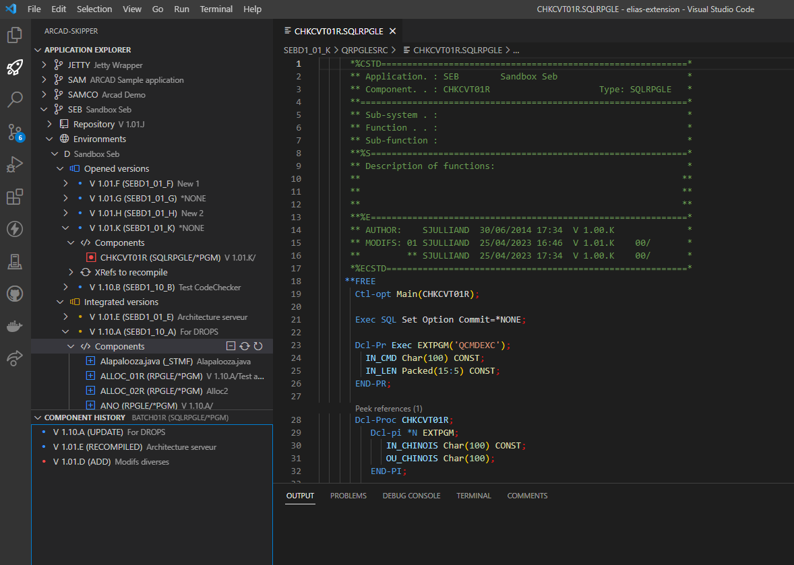
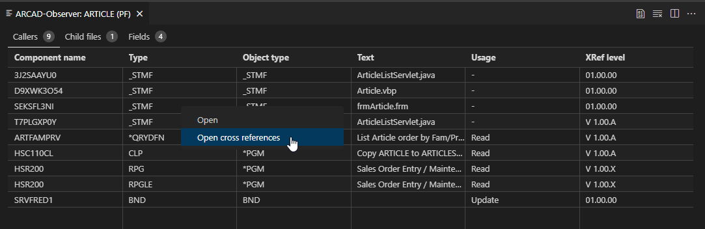
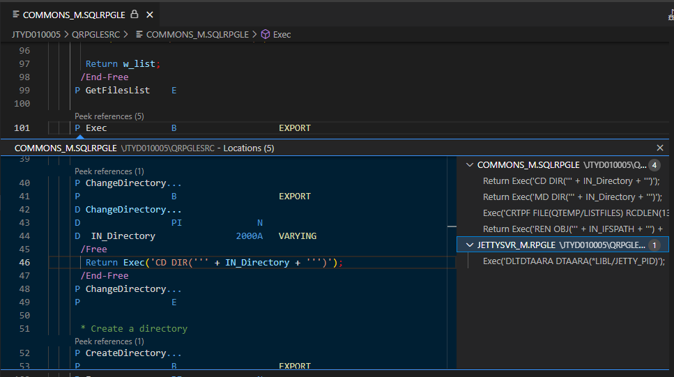
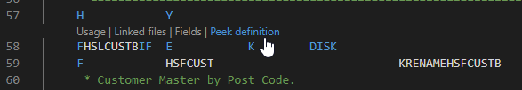
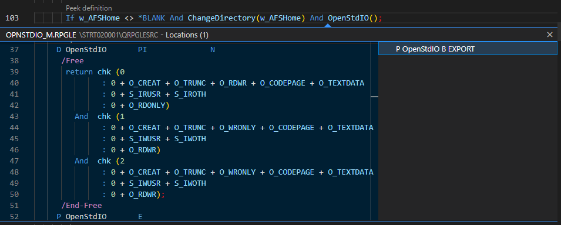

# ARCAD-Elias VSCode extension
`ARCAD-Elias` gives developers access to ARCAD for DevOps features in VSCode.

## ARCAD projects 🔨
You can now work from VSCode in `project mode`, just as in any Git-hosted project. You can modify source, compile and build in ARCAD without needing to check-out/check-in your source. The integration with ARCAD is transparent and you can work on any Git branch, local or remote, in the same way as on any other platform, without needing to take care of any IBM i specifics on the backend. All complex ARCAD/IBM i tasks are performed automatically by the `ARCAD-Elias` tooling.

## ARCAD-Skipper 🚀
Work with `ARCAD-Skipper` like you did on 5250 or RDi! Browse applications repositories, checkout components in versions and start making some changes.

## ARCAD-Observer 🔎
Browse your application's cross-references with ease! `ARCAD-Observer` can be accessed from the explorers as well as through CodeLenses, displaying relevant information about the source being modified right into the editor!

<!-- tabs:start -->
#### **Observer**

#### **Codelenses**
Procedure references 

Files codelense 

Procedure definition 

<!-- tabs:end -->

## ARCAD-Transformer RPG 🏭
Whether you're working from `project mode` or `ARCAD-Skipper`, you can call upon `ARCAD-Transformer RPG` to transform any RPGLE fixed format source to Fully Free RPG.