# Observer CodeLens
As explained in VSCode's blog:
> CodeLens is a popular feature in Visual Studio Code. The essence of the feature is "actionable contextual information interspersed" in your source code. That's quite a mouthful. Let me break it down for you.
> CodeLens are links in your code:
> - Actionable - You can click on the link and something happens.
> - Contextual - The links are close to the code they are representing.
> - Interspersed - The links located throughout your source code.

Observer CodeLenses bring ARCAD cross references right in the source code.

## File CodeLens
The file codelens adds a CodeLens where files are used. It can be located on a `Dcl-F` instruction, an `SQL-exec` block or any CL instruction that manipulates a file.

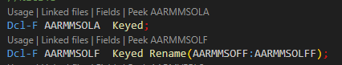

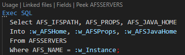

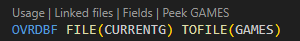

This codelens has 4 actions:
- Usage, Linked files and Field will open the Observer editor

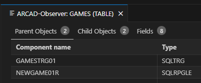

- Peek *file*

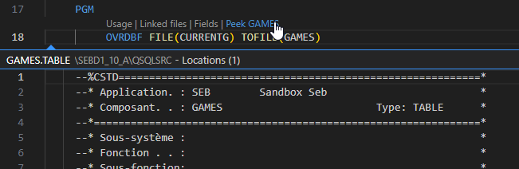

## Imported module CodeLens
This codelens will be found over procedure imported from an ILE module. It allows to peek the source of the module. It will be found over `Dlc-PR` or `EXTPROC` in RPGLE and over `CALLPRC` instructions in CL.

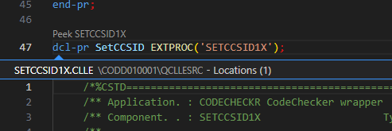

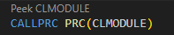

## Imported procedures CodeLens
This codelens is found over imported procedure called in the source code. Usually, these are procedures from a service program.

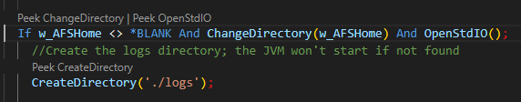

It allows to peek the source of the procedure and display its definition.

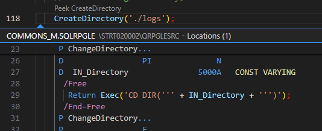

## Export procedures CodeLens
This codelens is found over procedures that are exported by a module. It allows to peek the source where the propcedure is called from (i.e. the procedure's callees).

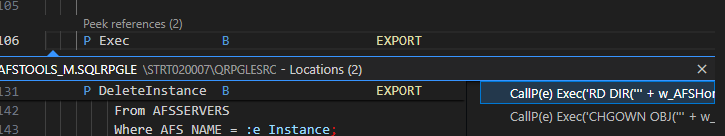

## Quickfix recompilation
When a component is opened but not compiled, the following VSCode problem will be added to the first line of the opened document:

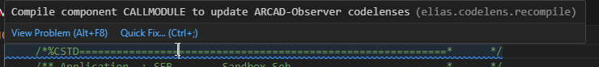

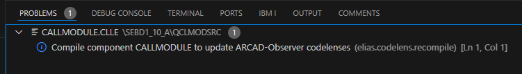

That because the codelens are based on the ARCAD Observer cross-references which are updated when the component is compiled. So a not-compiled component can have stale cross-references that needs to be refreshed with a new compilation.

The problem offers a `Quick Fix` that run the compilation.
- From the problem displayed in the source

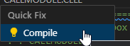

- From the Problems view

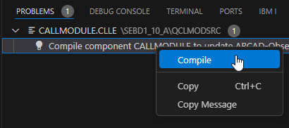