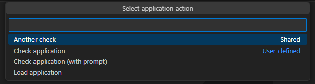

# Custom actions
Custom actions allow users to define their own actions to run on various element of the Skipper Explorer. There are two scopes of actions:
- Local actions, defined by and for the user only
- Shared actions, stored on the IFS and usable by every user

## Working with actions
Use these buttons at the top of Skipper Explorer to define actions.

Clicking on the button will open a submenu to select the kind of actions to work with.

After a target has been selected, a JSON editor will open to actually define the actions.

## Action definition
The JSON schema of the action editor supports the following attributes:

| Attribute | Description | Required |
| --------- | ----------- | -------- |
| name| The action name | **yes** |
| command | The command definition; supports `&XXX` placeholders to reference action target's properties. Example: `DLTOBJ OBJ(&LIBRARY/&NAME)`. | **yes** |
| description|Describes what the command does | no |
| prompt | If `true`, the command will be prompted before it's executed | no |
| submit | If `true`, the command will be submitted using `SBMJOB` | no |
| submitParameters | *SBMJOB* parameters to use if the command is submitted. Supports `&XXX` placeholders to reference action target's properties. Example: `JOB(&NAME) JOBQ(ARCAD_SYS/ARCAD_CTL)`. | no |
| interactive | If `true` and the command is a macro-command, then it will be executed in interactive mode (i.e. `ADSPLST` will stop the execution and display the list.) | no |

### Replacement variables
The `command` and `submitParameters` attributes both support replacement variables. The replacement variables are placeholders, starting with `&`, whose value will be replaced when the action is executed with the action target's values.

In this example, `&CODE` will be replaced by the application code the action is being run on: `ACHKAPP APP(&CODE)`

The list of each available replacement variables depend on the action type. The list can be accessed in the editor using content assist (see below).

### Content assist
The JSON editor supports content assist for defining actions.
Pressing `ctrl+space` will open the content assist panel that will list the available values, wherever the cursor is.

The content assist panel shows the available attributes and their description

If opened on a `command` or `submitParameter` line of the editor, the content assist will show the available replacement variables (placeholders):

### Syntax check
When actions are about to be saved, their syntax is checked for errors. The following checks are performed:

- Each action must have a name and a command
- Action name must be unique
- The command's syntax must be valid
- If defined, the submission parameters must be valid SBMJOB parameters

If a problem is detected, it is reported in the Problems view and highlighted in the editor.

## Running actions
To run an action, right click on a supported target in the Skipper Explorer and select the `Run Custom Action...` action.

The user will then be asked to select an action. The list of actions to chose from is based on the target type and it shows both Shared and User-Defined actions:

If the selected action has the `prompt` attribute set to `true`, the command will be prompted before being executed.

If the command being run is a macro-command, it will always be submitted and monitored, like any other macro-command run from VSCode. The submitParameters attribute, if defined, will still apply to the SBMJOB command used to submit it.

Otherwise, any other command will be executed or submitted, depending on its `submit` attribute.