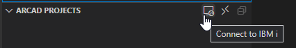
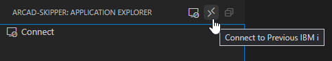

# Getting Started
1. Make sure you checked the [prerequisites](pages/prerequisites.md) and followed the steps from the [setup](pages/setup.md) section.
2. Download and install the `ARCAD-Elias` extension from [VSCode Marketplace](https://marketplace.visualstudio.com/items?itemName=arcadsoftware.arcad-elias).
3. Open the `Settings`, navigate to the `extension` > `ARCAD` section.
    - Update the `instance` code if your ARCAD instance is not `AD`
    - Specify the Elias REST API server address if it's not running on the IBM i you are connecting to
    - Update the port to match the Elias REST API's
    - If Elias REST API server is running on HTTPS, enable `Use HTTPS` and set the path to a local file containing the server's certificate chain in `PEM` format in the `Certificate` field.
4. You can now connect from Code for IBM i, Skipper explorer or from the ARCAD Projects explorer

