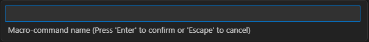
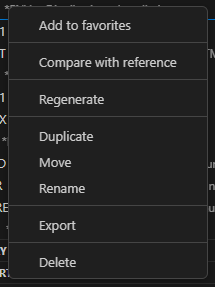
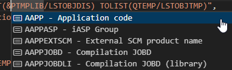

# Macro-commands
Macro-commands is a core feature of ARCAD allowing you to customize it in many ways. It is also a convenient way of running a set of commands with a lot of control options.
Think of it as scripted CL.

## Working with Macro-commands
To work with Macro-commands, open the MACROS/LISTS explorer. Click the `+` to select and add the libraries you want to work with.

Expanding the `Macro commands` node will list all the Macro-Commands found in this library.

### Creating a Macro-command
Click on the `+` on the `Macro commands` node.

The New Macro-command panel will open to let you define the initial settings of the macro-command to be created.

Click on `Create` to run the creation process. Once it's done, the new Macro-command will be opened for edition.

### Importing a Macro-command

Click on the `Import` button on the `Macro commands` node to open a file selection dialog. This will allow you to select a `.json` or `.savf` file, which are the available formats when exporting a Macro-command from VS Code.
Once a file has been selected, a prompt will ask for the name of the Macro-command being imported.

This does not have to be the same name as the Macro-command's when it was exported. Using an existing Macro-command name will prompt for overwritting it.

### Running a Macro-command
To run a Macro-command, click on the `Execute` button.

A prompt will open to ask if the Macro-command must be run in `Interactive` or `Batch` mode:
- `Interactive`: the Macro-command execution will stop on every `ADSPLST`/`AEDTLST` to open the list being displayed/edited. It will also stop on break messages.
- `Batch`: the Macro-command execution will stop on break messages only.

### Other actions
Right-clicking on a Macro-Commd will give access to these actions:

| Action | Description |
| --------- | ----------- |
| Add to favorites | Add the selected Macro-command to the explorer's `Favorites` section |
| Regenerate | Run the `AGENMACCMD` command on the selected Macro-command |
| Duplicate | Create a copy of the selected Macro-command in another library |
| Move | Move the selected Macro-command to another library |
| Export | Export and download the selected Macro-command as a `.json` or a `.savf` file |
| Delete | Delete the selected Macro-command |

## Macro-command definition
Clicking on a Macro-command will open it in an editor in JSON format.

### Sections
The Macro-commands JSON format defines four main sections. Every section and every subfield of it supports [content assist.](#content-assist)

#### Header
These are the general parameters of the Macro-command. When these fields are changed, the Macro-command is automatically regenerated when being saved.

#### Parameters
Each Macro-command parameter is described with a JSON object whose name is the parameter's variable name. The name must start with a P.

A code snippet is available in content-assist when defining parameters (press `ctrl+space`).

#### Sequences
The sequences are the commands runs sequentially during the Macro-command execution. The only required field for each command is the `command` field that defines the command line.

The `command` field supports Macro-command variables; since each variable starts with an `&`, pressing `&` shows the list of available variables. If the command line being defined is the `AEXCLST` command, then ARCAD List variables (starting with an `$`) are also shown when pressing `$`.

A code snippet is available in content-assist when defining sequences (press `ctrl+space`).

#### Subroutines
Subroutines are reusable sets of sequences. Each subroutine is a JSON object whose name is the subroutine's name. The object has two fields:
- `text`: the description of the subroutine
- `sequences`: an array of sequence, supporting the same elements as in the main [sequences](#sequences) field.

A code snippet is available in content-assist when defining subroutines (press `ctrl+space`).

### Content assist

The Macro-commands JSON format is entirely described thanks to a JSON schema which allows you to use VS Code editor's content assist extensively during the edition process.
The schema also describes every supported field and it validates the document's, showing relevant errors in the Problems view in case of error.

Pressing `ctrl+space` will show the content assist dialog that will show available content and snippets based on the cursor location.

Pressing `ctrl+space` or & in the command field of a sequence will show the list of available Macro-command variables:

