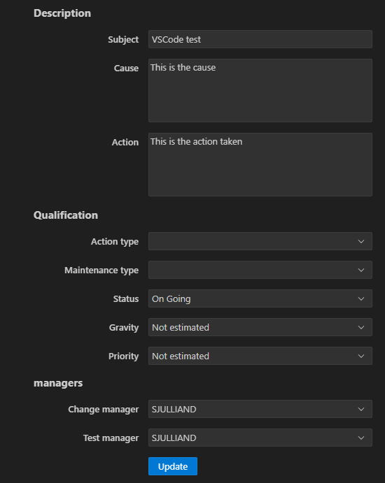
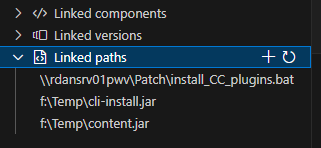
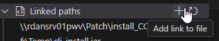

# Maintenance Reports
## List Maintenance Reports
### By year
From the Maintenance Reports view, click on the `Search by year` action.

A prompt will open to select a year amongst all the available years:

When a year is selected, the view is filled with all the maintenance reports for this year.

### By application/version/component
Right-click on an Application, a Version or a Component, expand the `Maintenance Reports` submenu and select `Show linked`.

If this action is run on an Application, a prompt will open to select a year. Then the maintenance reports linked to the selected entity (and year in case of an Application) will be listed in the view.

## Link Maintenance Reports
Right-click on a Version or a Component and select the `Link` action.

A prompt will open to select an option or a maintenance report, based on the entity:
- On a Version, the prompt will initially ask if all the maintenance reports or only of the application must be listed. It is also possible to create a maintenance report and link it right away.

- On a Component, the prompt will initially list all the maintenance reports linked to the Component's version ask if all the maintenance reports or those of the application must be listed.

Listing the all the maintenance reports or the application's will open a new prompt that will still shows the other options. It is possible to cycle between the different kind of lists without quitting the linking process.

## Create Maintenance Reports
Creating a new maintenance report can be done when using the `Link` action described above. Choosing the `Create Maintenance Report` option in the prompt will open the Maintenance Report editor:

Only the `Subject` and `Change manager` fields are required; the other fiels are optional.
The `Change manager` field is filled by default with the current user profile.
Once the `Create` button is clicked (or `Enter` pressed in a field), the maintenance report is created and linked to the version/component the `Link` action was run on.

## Working with Maintenance Reports
Right-click on a Maintenance report to work with it.

### Edit
The `Edit` action will open the editor to edit the selected maintenance report.

### Delete
Running the `Delete` action will show a modal confirmation dialog. The selected maintenance report will be deleted if the user clicks on `Confirm`.

### List linked entities
Each maintenance report can be expanded to list its linked entities.

#### Components and versions

Right clicking on components or versions listed here allows to run the Unlink action to delete the link between the selected entity and the maintenance report.

#### List linked paths
The `Linked paths` node shows the paths linked to this maintenance report. Paths are arbitrary strings which may or may not be accessible from the user's workstation.

- To add a linked path to the selected maintenance report, click on the `+` on the Linked paths node.

This action will prompt to choose between entering the path manually or selecting one or more files locally accessible (including network shares).

- Left click on a linked paths to open it in VSCode.

- Right click on a path to:
  - Reveal its location in the system's File Explorer
  - Unlink it