# Project mode

## Setup the solution

### Without an existing ARCAD application
In that case, you have an IBM i application not declared in ARCAD Skipper.

#### Change type of RPGLE copies
The first thing to is to change the RPGLE copies type to have the new RPGLEINC value.

It is possible to use PDM to do that.

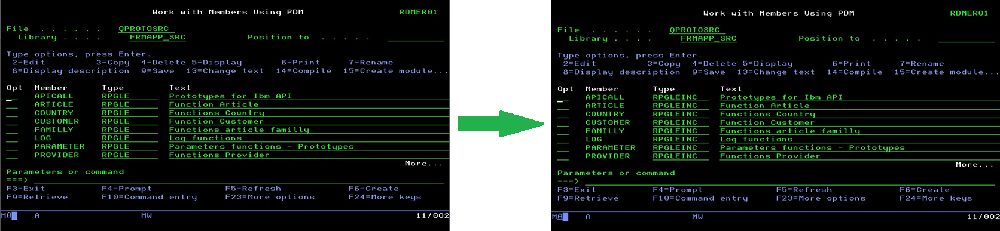

#### Declare an ARCAD application
The second step is to declare a new ARCAD application.

To do that, enter into ARCAD with the command ARCAD_ENG/ARCAD and then use the ADCLAPP command and 
- fill the Application ID (if your Application ID is longer than three characters, fill also the Library name prefix)
- add a Brief description
- fill the Application Manager 
- fill the Operational libraries (i.e. not only the libraries that contain the source members that will be pushed to Git but also the libraries that contain the objects and files of your application)
- press ENTER

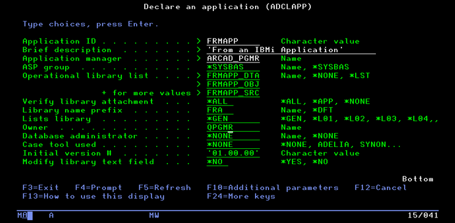

Then complete the library list for your application to make it useable and press ENTER.

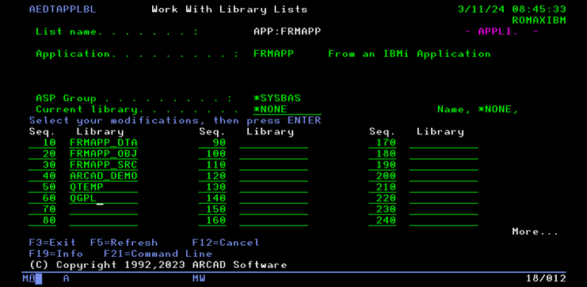

#### Generate Sources for SCM
Before loading the ARCAD repository, the third step is to generate a source for components that normally usually do not need it, such as *DTAARA, *MSGF, *SRVPGM, etc.

This is mandatory for an SCM like Git which only manages sources.

To do that, use the GENSCMSRC macro-command and
- fill the Application ID
- fill the Source file library (use one of the libraries indicated in the previous step)
- press ENTER.

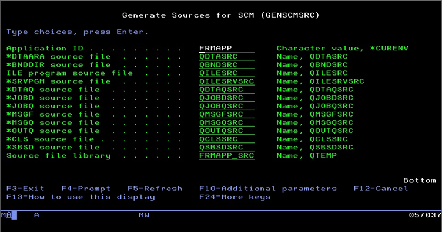

> If you have many objects like this, it is recommended to launch this macro in batch.

#### Load the ARCAD repository
To do that, use the DECLARE3 macro-command, fill the Application ID and press ENTER.

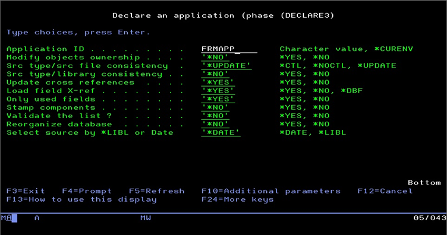

> Warning: if there are many source members, submit this macro-command.

#### Create development environment
A development environment in mandatory to create a version in ARCAD.

To do that, use the ADCLENV command and
- fill the Application ID
- fill the Environment ID
- fill *DEV for the Type of environment
- fill *NRM for Implementation mode
- add a Brief description
- fill a Prefix for version library if your Application ID is longer than three characters
- press ENTER

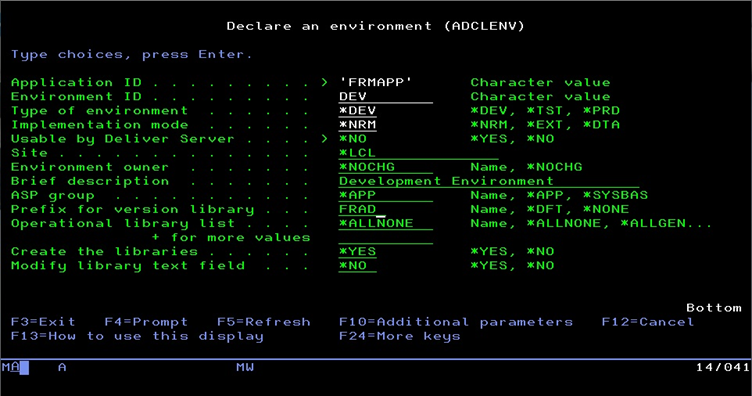

#### Create version type
Finally, you need to create a version type for your application.

To do that, use the AWRKVERTYP command, press ENTER and then use the option 3=Copy for the three standard version types *FEATURE, *RELEASE and *SANDBOX.

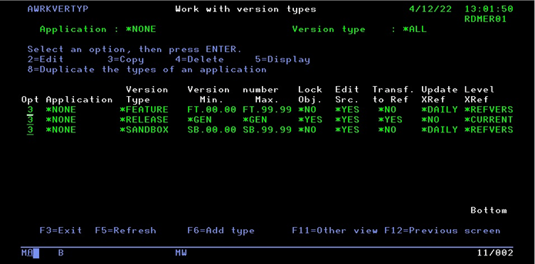

For these three types, fill the Application field and set the Check-out from reference parameter to *SCM.

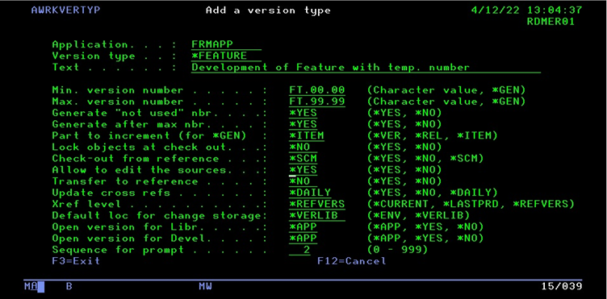

> When the copy is created, you can use the AWRKVERTYP command for your application to check and/or to change these types.

> You can go now to the [With or without an existing ARCAD application](#With-or-without-an-existing-ARCAD-application) chapter.

### With an existing ARCAD application 
In that case, you have an IBM i application declared in ARCAD Skipper.

#### Change type of RPGLE copies
Do the same modifications as in the previous [Change type of RPGLE copies](#Change-type-of-RPGLE-copies) chapter. 

#### Generate Sources for SCM
If you never used another SCM than ARCAD Skipper, follow the steps described in the previous [Generate Sources for SCM](#Generate-Sources-for-SCM) chapter and reload your ARCAD repository.

#### Create version type.
Finally, create version types as it was explained in the previous [Create version type](#Create-version-type) chapter.

> You can go now to the [With or without an existing ARCAD application](#With-or-without-an-existing-ARCAD-application) chapter.

### With or without an existing ARCAD application
#### Create a remote Git repository 
The next step of setup is to create a Git Repository.

Go to the solution you want to use and create a new project/repository.

Enter a repository name, a description, choose the visibility level, create the new repository with a README file and click on the Create project or Create repository button.

An empty repository was created.

It is possible now to copy the SSH URL to add it into the ARCAD application.

#### Update application operational attributes
It is time now to edit your operational attributes in order to make a link between your application and your Git repository.

To do that, use the AEDTAPPATR command for your application and set the Name of the External SCM product parameter to GIT, paste the SSH URL of your Git repository in the Repository URI parameter and press ENTER.

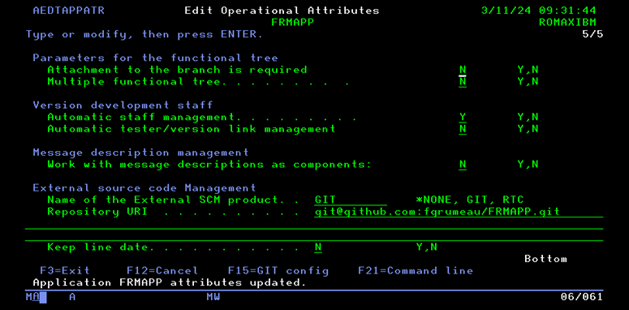

Then, press F15=GIT config to finish the Git Configuration.

On the new menu
- use option 1 to change the default branch name if needed.

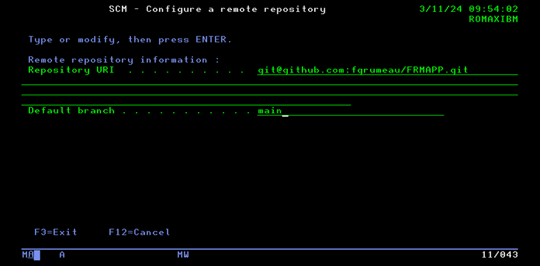

- use option 5 to change MERLIN parameters and put *YES for the parameter Define as a MERLIN project and change if you want the generation IFS directory.

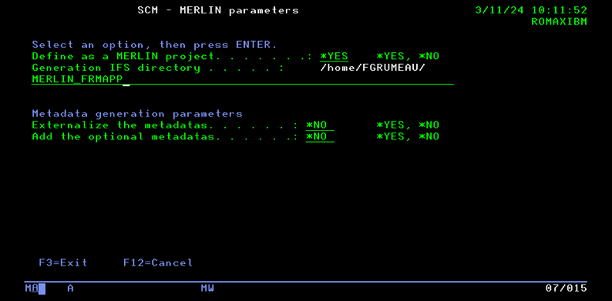

Then, you can press F3 several times to exit the different menus.

> When you are on the AEDTAPPATR screen, you can also set the Source member header update to *NONE and set the Mandatory attachment of document/component to N.

#### Generate SSH keys and add them to your Git profile
If you did not have SSH keys for your profile on your IBM i, you need to calculate one and add it to your Git profile.

To create SSH keys, you can use the AGENSSHKEY ARCAD Command or the SSH-KEYGEN command in a QSH session.

With the ARCAD Command, fill the Key type you want to generate, set the Action parameter to *GEN and then press ENTER.

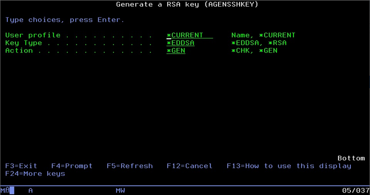

When keys are generated, display and copy the public key and then paste it in your Git profile.

After that you are ready to send all the source members from the ARCAD Skipper repository to the Git repository.

#### Loading the remote Git repository
To send all the source members to the Git repository use the ARCAD macro-command LODSCMREP, fill the Application ID parameter and press Enter.

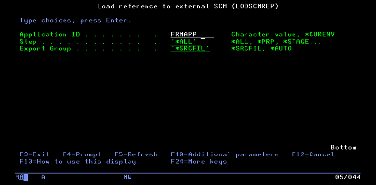

> If you have many source members in your application, it is recommended to launch this macro-command in batch.

#### Clone the Git repository in your workspace
Go to your workspace, select the option to clone a repository and paste the SSH URL of your Git repository to clone it.

When the clone process is finished, you can see all the source members in your workspace.

#### Connect to the IBM i
Go to the node CONNEXIONS to see the connexion to IBM i you can used then click on the triangle icon to do the connexion.

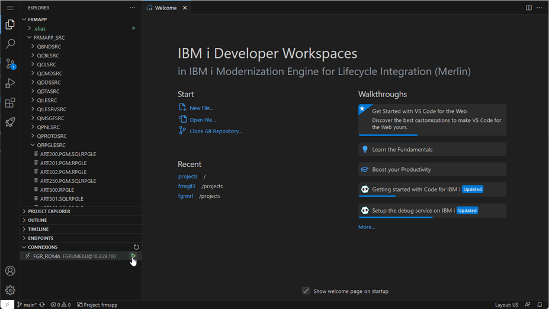

#### Complete the setup

When the connexion is done, go to the node PROJECT EXPLORER, and after a right click on the project, select the option Configure project for ARCAD.

That will create some new files (.gitignore and .arcadignore)

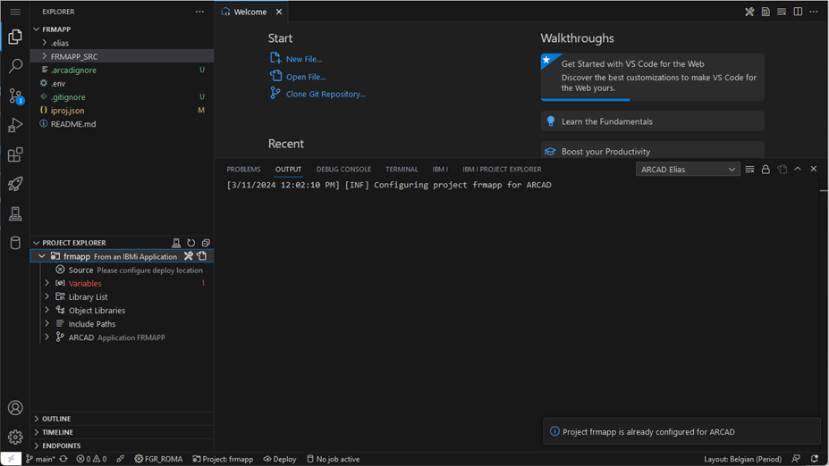

Go now in the Git extension to commit and push all changed and added files.

Stage the files, add a commit message and press on Commit.

Then click on Sync Changes to push these files into the remote Git repo.

> You may need to configure your name and email address for Git to perform these actions.  
To do this, simply go to a terminal and run the commands git config user.name “Your Name” and git config user.email “Your email”
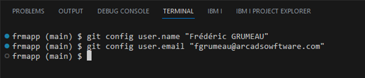

Now it is possible to use this setup for development.

## Use the solution to develop

### Creating a branch
The first thing to do is to create a feature branch.

This action can be performed in your Git repository or directly in your workspace.

If you do this action in your Git repository then you will have to select this branch in your workspace.

To do this action directly in the IBM i Developer workspace, click on "main" (or on the name of your default branch) which is at the bottom left of your workspace.

On the top of your workspace a menu appears, select Create new branch.

Enter the name of your new branch, this name must begin with “feature/”, and press ENTER to create a new local branch.

Now you can see the name of your branch in the bottom left of the workspace.

Click on the Source Control:Git icon to open the Source Control view and push your feature local branch into your Git repository.

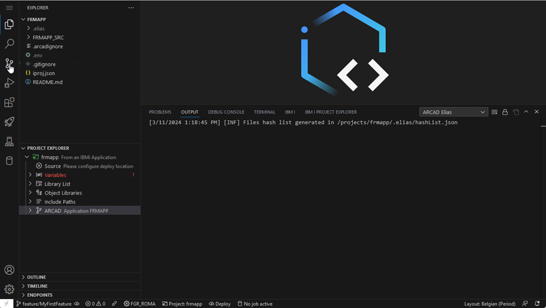

In the Source Control:Git part of your workspace, click on Publish Branch.

When the push action is complete, you can see in your Git repository the new feature branch.

You are now ready to make changes in the application.

### Display cross-references
Before you start making changes, you can browse links between components by using the ARCAD Xrefs.

To do so, right-click on a source member and select the Open in ARCAD-Observer option.

A view appears with links to programs (Parents Objects), links to files (Child files) and links to fields.

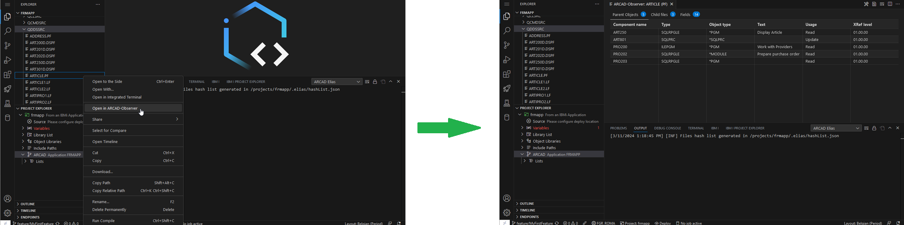

With a right click on a component, it is possible to follow links.

When you follow many links, it is possible to come back to a previous component with a click on its tab.

###	Modifying sources in MERLIN
To edit a source, click on it.

The editor view appears, so it is possible to do your modification.

When a modification is done, the icon on the tab to the right of the component name is changed from the closing cross to a full circle and a badge appears on the Explorer icon.

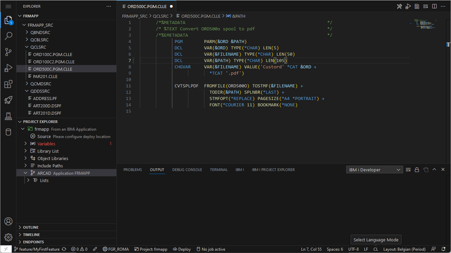

Press Ctrl+S to save you modifications. The full circle disappears, the badge disappears on the Explorer icon, a badge appears on the Git icon and a M (modified) appears to the right of the component name and to the right of the folder names.

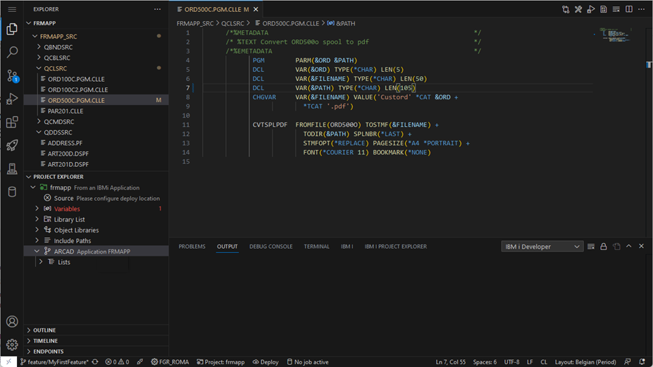

### Compiling in a sandbox
During a development, it can be interesting to compile a source member to check that the compilation works and to be able to do some unit tests.

To do that, do a right click on a source member and select Run Compile.

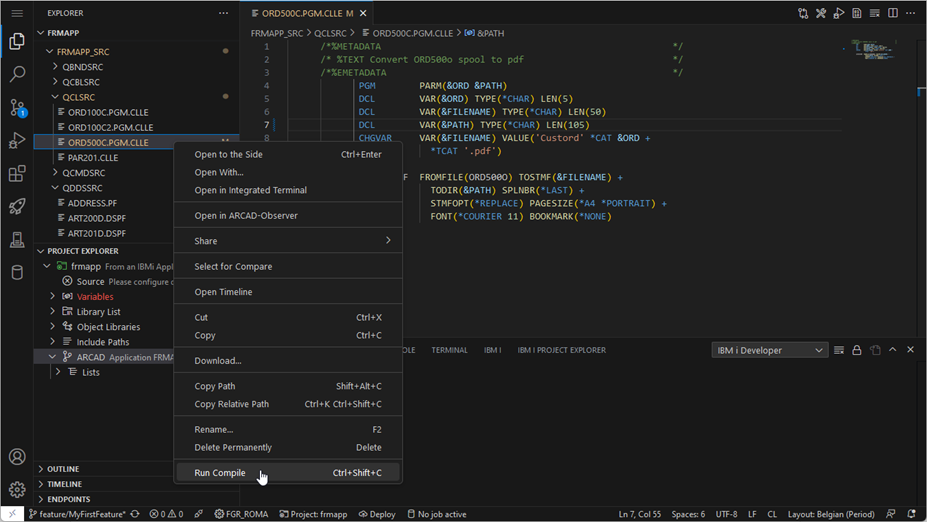

The compiling job starts.

It is possible to follow the process.

This job creates a new version, a sandbox version linked to the feature version only for the developer and a feature version was also created.

The compilation is done in this sandbox version. 

When the compilation is finished, many things appear in your IBM i Developer workspace.

In the ARCAD part of the PROJECT EXPLORER it is possible to see the new versions (their names and the name of the library linked) and the compiled object.

In the PROJECT Part, it is possible to see the creation of “logs” files.

You can display the spooled file, the joblog and also the output.log of the compilation job.

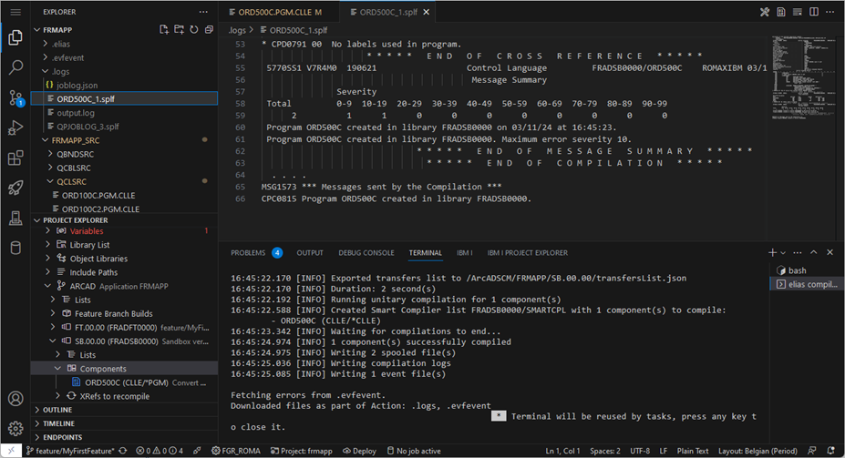

### Building in a sandbox
If you have a lot of modifications and want to compile everything, including dependencies (like for example programs that use modified files), then in this case you can run a build.

For example we have just modified three source members and we want to launch the build.

To do that, just press F1 and select the Project Explorer: Run Build option.

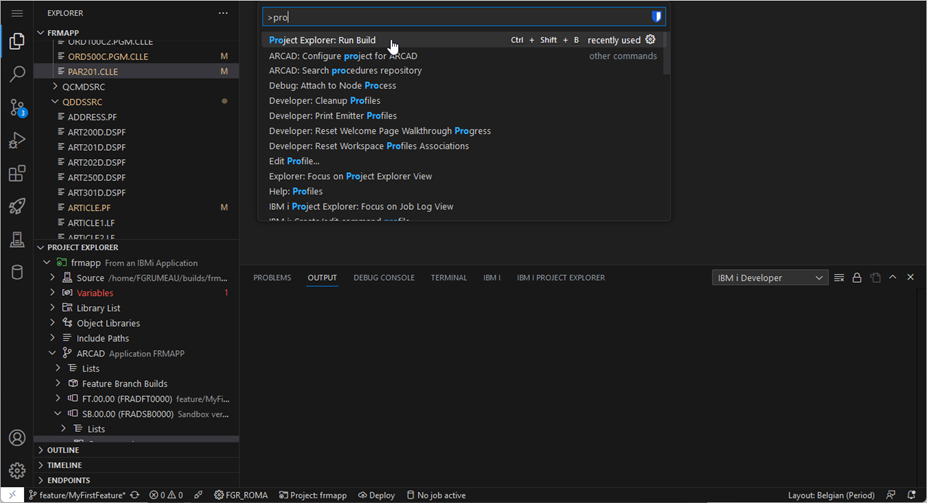

The build job starts. 

As for the compilation, it is possible to follow it.

This job uses the same sandbox version (it is created if it does not exist already) and this time, the job will compile all the modified source members and all the components impacted by the change in the PF (logical, linked programs).

When the build is finished, many things appear in your IBM I Developer workspace like for a compilation.

It is possible to display, if needed the spooled files, the joblogs, the evfevent files, etc.

And if you go to the ARCAD part of the PROJECT EXPLORER, for the sandbox version, you will see more than three source members recompiled, those with the information Update.

You can also see all the automatic recompilations done by the build, (those with the information recompiled).

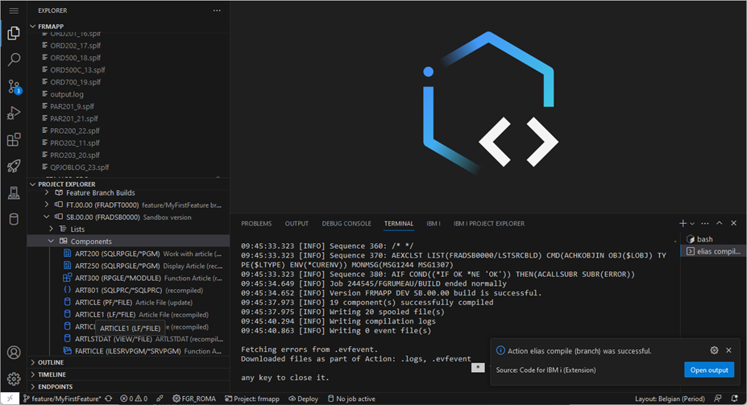

> You will see all recompiled component only if the option Hide recompiled components in Settings is unchecked.              
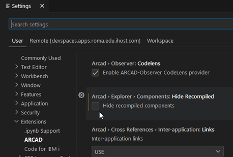

Like for the compilation, all the modified components and recompiled components are in the version library.

It is possible to do unit test and make additional changes if needed.

### Free RPG transformations
In this section, we will edit a (SQL)RPGLE to convert it into fully-free format.

On the source member or in the source edition, do a right-click and select the Transform to Fully-free RPG with ARCAD option.

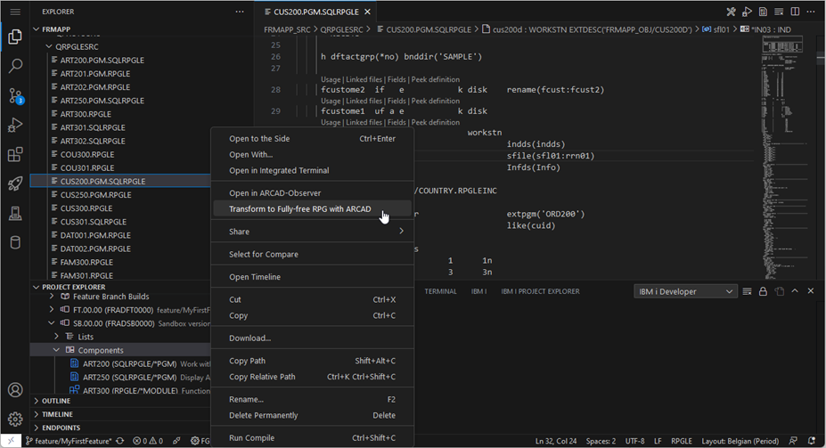

The conversion automatically starts and when it is finished, the editor view is automatically refreshed.

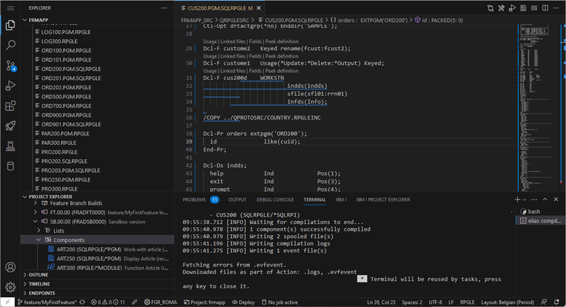

After the conversion, the component is automatically recompiled.

So, in case of an error, check the compilation log to have more information, and in case of a problem during the conversion, a conversion log is generated with the.trg.log extension.

### Commit and push
When all changes are made, they can be sent to the feature branch as well as to the Arcad version linked to this feature in order to make them available to other developers working on this feature.

For that, you need to commit them and then to push them to the Git repository, before launching the building process.

To do that, click on the Source Control: Git icon.

You will see all the modifications.

You can stage them one by one with a right-click or by using the + icon.

You can click on a source to display the difference.

Or you can select all source members, do a right-click and select the Stage Changes option.

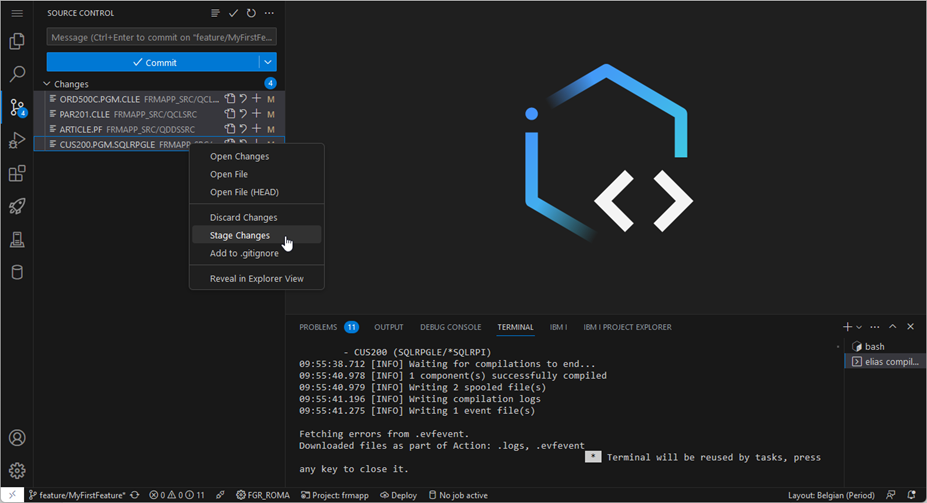

Now you can add a commit message and launch the commit.

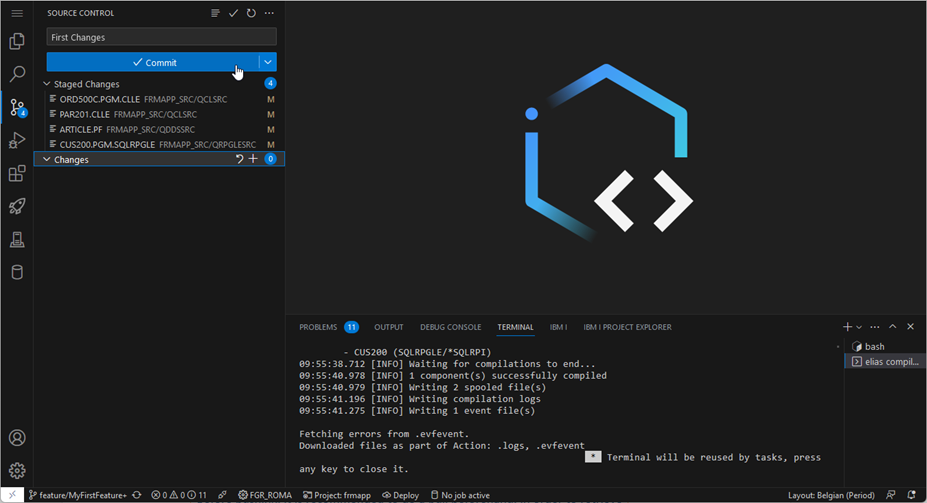

Click on Sync Changes to send the changes to the Git repository.

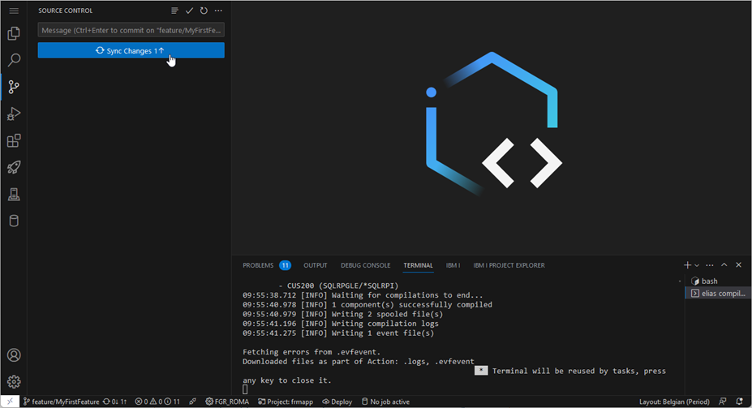

> Before pushing, it is recommended to do a pull beforehand, in order to retrieve the commits of other developers working on the same feature.  
And after the push, you can also do a pull to retrieve the last commit.

### Building your version with ARCAD Builder
To launch the build of the feature with ARCAD Builder, click on the Explorer icon, select the Feature Branch Builds node on the PROJECT EXPLORER part, do a right-click on the Feature Branch Builds and select the option Request feature build with ARCAD-Builder.

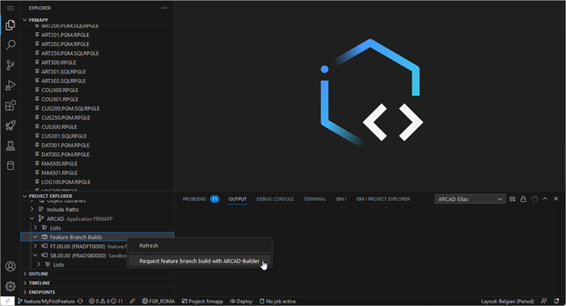

After using the option, you can explore the Feature Branch Builds node and see a running build.

It is possible to refresh the information by doing a right click and select the option Refresh.

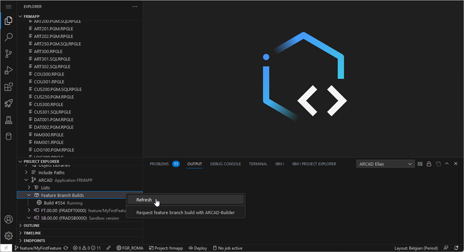

You can click on a running build to display the running log.

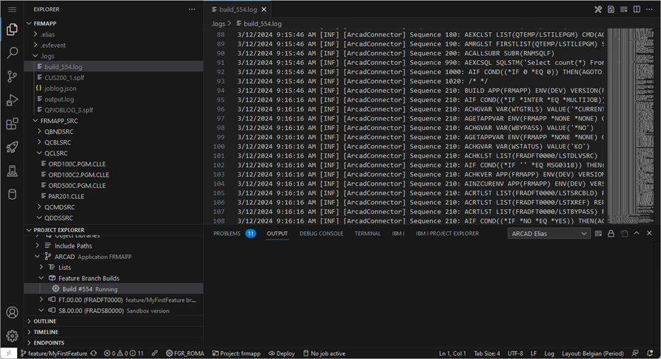

This log is important if there is a problem during the build.

When the build is finished, you can have the result directly on your workspace.

The workspace displays a Failed message if the build fails, and a Succeeded (completed) message if the build is completed successfully.

If there is nothing to build, it displays an Empty message (this happens when you launch the build without pushing new changes).

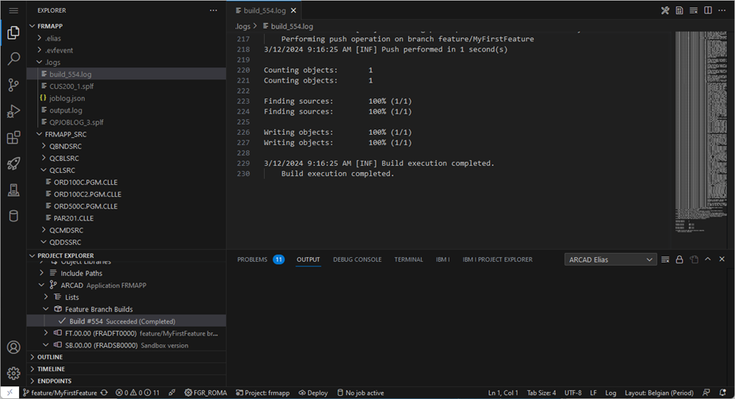

And now, if you click on the Components node for the feature version, you will see the components of the feature.

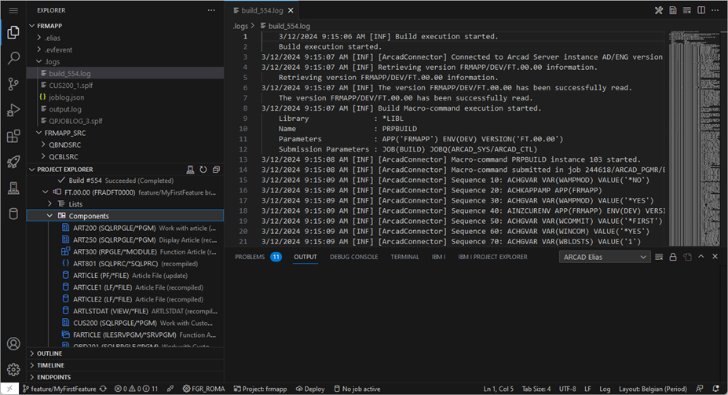

### The next step – The release branch
The next logical step is to create a new release branch, that will create a new ARCAD release version.

Then, it will be possible to merge some features into this release and launch an ARCAD build to have all the components in this new version.