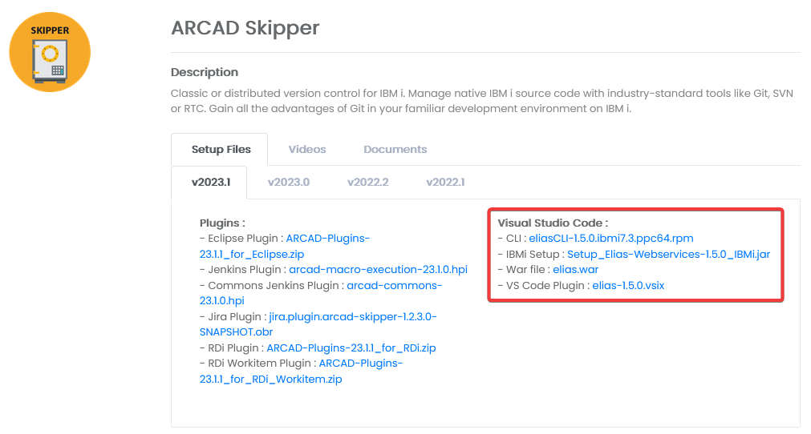

# Setup
## Get the files
Go to [ARCAD's Customer Portal](https://portal.arcadsoftware.com/); enter the `Products` section and open the `ARCAD Skipper` section. All the files mentionned below will be found under the `Visual Studio Code` category.


## Elias REST API Server
The Elias REST API Server comes packaged as a `.war` file. It can run on any operating system that supports Java. It must be deployed on an application server (e.g. IBM i integrated Web Application Server or Jetty), under the `/elias` context.
A pre-packaged, ready to use Jetty installation can be found on [ARCAD's Customer Portal](https://portal.arcadsoftware.com/). It contains a Jetty runtime packaged with `elias.war`.

### Pre-packaged JETTY IBM i installation
1. Copy the `Setup_Elias-Webservices-X.Y.Z_IBMi.jar` on the IFS, in the `/tmp` folder.
2. Open a QShell session or connect using SSH
3. Go to the `/tmp` folder and start the installation process
```
cd /tmp
java -jar Setup_Elias-Webservices-X.Y.Z-SNAPSHOT_IBMi.jar
```
4. The installation process will ask for several installation values, with default values between brackets. Press ENTER to accept the default values or enter the desired value then press ENTER.
5. After the installation, start the JETTY subsystem to start JETTY web application server. For example, if you installed JETTY in the default `JETTY` library: 
    - `STRSBS JETTY/JETTY`
6. Alternatively, JETTY can started and stopped using the following commands:
    - `JETTY/STRJTYSVR`
    - `JETTY/ENDJTYSVR`

## Elias CLI
The Elias CLI comes packaged as an `.rpm` file. It required if you plan on developing your applications using Project mode. It must be installed on the development IBM i server. It can be download from [ARCAD's Customer Portal](https://portal.arcadsoftware.com/).

### Installation
1. Copy the `eliasCLI-X.Y.Z.ibmi7.3.ppc64.rpm` on the IFS, in the `/tmp` folder.
2. Open a QShell session or connect using SSH
3. Install or update Elias CLI using yum: `yum install /tmp/eliasCLI-X.Y.Z.ibmi7.3.ppc64.rpm`