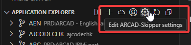
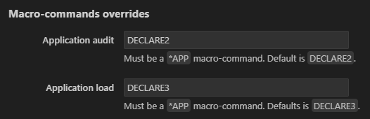

# ARCAD-Skipper settings
Open the ARCAD-Skipper settings editor from the Application Explorer view toolbar.

## Macro-commands overrides

Some actions in Skipper are performed using macro-commands, allowing users to customize some processes like transferring a version to test environments or to reference. These settings allows user to override the default macro-command and replace them with another macro-command.

Each field expects a macro-commmand name that can be qualified with its library name.

The actions using macro-commands that can be overridden are:
- Application audit: must be a `*APP` macro-command. Default is `DECLARE2`.
- Application load: must be a `*APP` macro-command. Defaults is `DECLARE3`.
- Transfer to test: must be a `*MEV` macro-command. Default is `INTEGR`.
- Transfer to reference: must be a `*VER` macro-command. Default is `TFRREF`.
- Export version to SCM: must be a `*VER` macro-command. Default is `EXPSCMVER`.