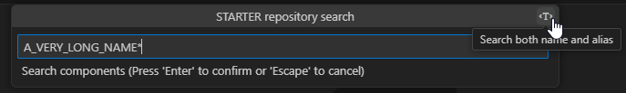

# Tips & tricks
## Search components by alias/long names
When searching a component in the repository or a version, it possible to search by alias/long names by clicking on the button located at the top-right corner of the input box.

## Multi-selection in Skipper Explorer
The Skipper Explorer supports multi-selection. Using `ctrl+click` and/or `shift+click`, it's possible to select a set of elements and run actions on them.

